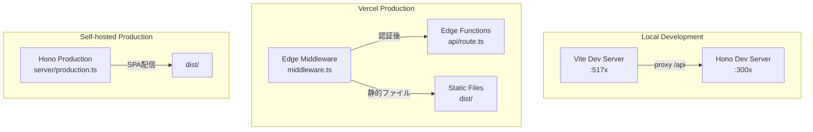
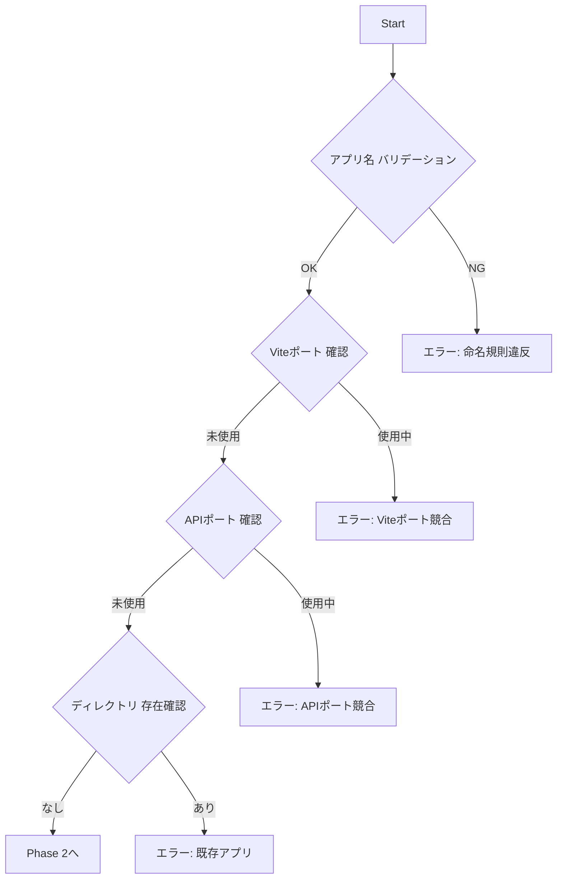

# Add New App to Workspace

pnpm workspaces + Turborepo モノレポへ **Hono APIサーバー統合済み** の新規アプリを追加するコマンド

> 🤖 **Context Engineering**: このコマンドは段階的に情報を収集し、各ステップで検証を行いながら新規アプリをセットアップします。

---

## 🎯 Goal

`apps/` ディレクトリ配下に以下を含む新しいアプリケーションをセットアップ：

- **フロントエンド**: React 19 + Vite + Tailwind CSS v4
- **バックエンド**: Hono + OpenAPI + Swagger UI
- **デプロイ**: Vercel Edge Functions + Edge Middleware
- **共有パッケージ**: `@myorg/ui`, `@myorg/shared`, `@myorg/ai`

---

## 📐 Architecture Overview



---

## 📥 Required Inputs

以下の情報を収集してからセットアップを開始する：

| 入力項目 | 説明 | 例 | バリデーション |
|---------|------|-----|---------------|
| **appName** | アプリ名（kebab-case） | `dashboard`, `portal` | `^[a-z][a-z0-9-]*$` |
| **vitePort** | Vite開発サーバーのポート番号 | `5175` | 5173, 5174 以外の未使用ポート |
| **apiPort** | Hono APIサーバーのポート番号 | `3002` | 3000, 3001 以外の未使用ポート |
| **title** | HTMLのタイトル | `Dashboard App` | 任意の文字列 |
| **apiTitle** | OpenAPI ドキュメントのタイトル | `Dashboard API` | 任意の文字列 |
| **authScope** | 認証スコープ | `api-only` or `full-app` | 選択式 |
| **description** | アプリの説明（任意） | `社内ダッシュボード` | 任意 |

### 🔐 認証スコープの選択

| スコープ | 説明 | 用途 |
|---------|------|------|
| `api-only` | `/api/v1/*` のみ認証 | 公開フロントエンド + 保護されたAPI |
| `full-app` | 全画面認証（/health除く） | 管理画面・内部ツール |

### 🔍 Context Collection Prompt

```
新規アプリを追加するために、以下の情報を教えてください：

1. アプリ名は何にしますか？（例: dashboard, portal, analytics）
   - kebab-case（小文字とハイフン）で入力してください

2. ポート番号の設定
   - 既に使用中:
     - Vite: 5173 (@myorg/web), 5174 (@myorg/admin)
     - API: 3000 (@myorg/web), 3001 (@myorg/admin)
   - 推奨: Vite=5175〜, API=3002〜

3. ページタイトルは何にしますか？（例: Dashboard App）

4. API ドキュメントのタイトルは？（例: Dashboard API）

5. 認証スコープはどちらですか？
   - api-only: APIのみ認証（公開フロントエンド）
   - full-app: 全画面認証（管理画面向け）
```

---

## 🔄 Execution Steps

### Phase 1: Pre-flight Checks（事前確認）



#### Step 1.1: アプリ名のバリデーション

```bash
# kebab-case チェック（小文字とハイフンのみ）
if [[ ! "$APP_NAME" =~ ^[a-z][a-z0-9-]*$ ]]; then
  echo "❌ エラー: アプリ名は小文字のkebab-caseで指定してください"
  exit 1
fi
```

#### Step 1.2: ディレクトリ存在確認

```bash
if [ -d "apps/$APP_NAME" ]; then
  echo "❌ エラー: apps/$APP_NAME は既に存在します"
  exit 1
fi
```

#### Step 1.3: ポート番号の確認

```bash
# 既存アプリのViteポート番号を確認
grep -r "port:" apps/*/vite.config.ts | grep -v node_modules

# 既存アプリのAPIポート番号を確認
grep -r "port.*||" apps/*/server/dev.ts | grep -v node_modules
```

> ⚠️ 使用中ポート:
> - Vite: 5173（web）、5174（admin）
> - API: 3000（web）、3001（admin）

---

### Phase 2: ファイル生成

#### Step 2.1: ディレクトリ構造作成

```bash
mkdir -p apps/${APP_NAME}/{src,server/routes,api}
```

#### Step 2.2: package.json 生成

> 📝 **注意**: `@myorg/*` は実際のパッケージ名プレフィックスに置き換えること

```json
{
  "name": "@myorg/${APP_NAME}",
  "version": "0.0.0",
  "private": true,
  "type": "module",
  "scripts": {
    "dev": "vite",
    "dev:api": "tsx watch server/dev.ts",
    "build": "tsc -b && vite build",
    "preview": "vite preview",
    "start": "tsx server/production.ts",
    "typecheck": "tsc --noEmit",
    "lint": "biome check --write .",
    "lint:check": "biome check ."
  },
  "dependencies": {
    "@ai-sdk/react": "beta",
    "@myorg/ai": "workspace:*",
    "@myorg/shared": "workspace:*",
    "@myorg/ui": "workspace:*",
    "@hono/node-server": "^1.19.7",
    "hono": "^4.11.1",
    "react": "^19.2.3",
    "react-dom": "^19.2.3",
    "zod": "^4.2.1"
  },
  "devDependencies": {
    "@hono/zod-openapi": "^1.1.5",
    "@scalar/hono-api-reference": "^0.9.28",
    "@vercel/edge": "^1.2.1",
    "@tailwindcss/vite": "^4.1.18",
    "@types/node": "^25.0.2",
    "@types/react": "^19.2.7",
    "@types/react-dom": "^19.2.3",
    "@vitejs/plugin-react": "^5.1.2",
    "tailwindcss": "^4.1.18",
    "tsx": "^4.21.0",
    "typescript": "~5.9.3",
    "vite": "^7.3.0"
  }
}
```

#### Step 2.3: tsconfig.json 生成（フロントエンド用）

```json
{
  "compilerOptions": {
    "target": "ES2022",
    "lib": ["ES2023", "DOM", "DOM.Iterable"],
    "module": "ESNext",
    "skipLibCheck": true,
    "moduleResolution": "bundler",
    "allowImportingTsExtensions": true,
    "verbatimModuleSyntax": true,
    "moduleDetection": "force",
    "noEmit": true,
    "jsx": "react-jsx",
    "strict": true,
    "noUnusedLocals": true,
    "noUnusedParameters": true,
    "noFallthroughCasesInSwitch": true,
    "paths": {
      "@/*": ["./src/*"]
    }
  },
  "include": ["src/**/*"]
}
```

#### Step 2.4: vite.config.ts 生成

```typescript
import { resolve } from 'node:path';
import tailwindcss from '@tailwindcss/vite';
import react from '@vitejs/plugin-react';
import { defineConfig } from 'vite';

/**
 * ${APP_NAME} アプリケーションの Vite 設定
 */
export default defineConfig({
  plugins: [react(), tailwindcss()],
  resolve: {
    alias: {
      '@': resolve(import.meta.dirname, './src'),
    },
  },
  server: {
    port: ${VITE_PORT},
    proxy: {
      '/api': {
        target: 'http://localhost:${API_PORT}',
        changeOrigin: true,
      },
    },
  },
});
```

#### Step 2.5: index.html 生成

```html
<!doctype html>
<html lang="ja">
  <head>
    <meta charset="UTF-8" />
    <link rel="icon" type="image/svg+xml" href="/vite.svg" />
    <meta name="viewport" content="width=device-width, initial-scale=1.0" />
    <title>${TITLE}</title>
  </head>
  <body>
    <div id="root"></div>
    <script type="module" src="/src/main.tsx"></script>
  </body>
</html>
```

#### Step 2.6: src/index.css 生成（Tailwind CSS v4）

```css
@import 'tailwindcss';

@theme {
  --color-background: hsl(0 0% 100%);
  --color-foreground: hsl(222.2 84% 4.9%);
  --color-muted-foreground: hsl(215.4 16.3% 46.9%);
  --color-primary: hsl(222.2 47.4% 11.2%);
  --color-primary-foreground: hsl(210 40% 98%);
}

@media (prefers-color-scheme: dark) {
  @theme {
    --color-background: hsl(222.2 84% 4.9%);
    --color-foreground: hsl(210 40% 98%);
    --color-muted-foreground: hsl(215 20.2% 65.1%);
    --color-primary: hsl(210 40% 98%);
    --color-primary-foreground: hsl(222.2 47.4% 11.2%);
  }
}
```

#### Step 2.7: src/main.tsx 生成

```typescript
import { StrictMode } from 'react';
import { createRoot } from 'react-dom/client';
import { App } from './App';
import './index.css';

const rootElement = document.getElementById('root');
if (!rootElement) {
  throw new Error('Root element not found');
}

createRoot(rootElement).render(
  <StrictMode>
    <App />
  </StrictMode>,
);
```

#### Step 2.8: src/App.tsx 生成

```typescript
import { Button, cn } from '@myorg/ui';
import type { FC } from 'react';

/**
 * ${APP_NAME} アプリケーションのルートコンポーネント
 * ${DESCRIPTION}
 */
export const App: FC = () => {
  return (
    <div className={cn('min-h-screen bg-background p-8')}>
      <h1 className="text-3xl font-bold mb-4">${TITLE}</h1>
      <p className="text-muted-foreground mb-4">
        @myorg/ui パッケージのコンポーネントを使用しています
      </p>
      <Button onClick={() => alert('Hello from ${APP_NAME}!')}>
        クリックしてね
      </Button>
    </div>
  );
};
```

---

### Phase 2.5: Hono サーバーファイル生成

#### Step 2.9: server/tsconfig.json 生成

```json
{
  "extends": "../../../tsconfig.json",
  "compilerOptions": {
    "target": "ES2022",
    "module": "NodeNext",
    "moduleResolution": "NodeNext",
    "outDir": "../dist-server",
    "rootDir": ".",
    "strict": true,
    "esModuleInterop": true,
    "skipLibCheck": true,
    "noEmit": false
  },
  "include": ["./**/*.ts"],
  "exclude": ["node_modules"]
}
```

#### Step 2.10: server/app.ts 生成

```typescript
import type { ApiError } from '@myorg/shared';
import { OpenAPIHono } from '@hono/zod-openapi';
import { Scalar } from '@scalar/hono-api-reference';
import type { Context, Next } from 'hono';
import { cors } from 'hono/cors';
import { HTTPException } from 'hono/http-exception';
import { prettyJSON } from 'hono/pretty-json';
import { requestId } from 'hono/request-id';
import { secureHeaders } from 'hono/secure-headers';
import { healthRoutes } from './routes/health.js';

/**
 * リクエストID付きHono Context型
 */
type Variables = {
  requestId: string;
};

/**
 * Honoアプリケーションインスタンス
 * @description 認証は各サーバー設定で適用
 */
const app = new OpenAPIHono<{ Variables: Variables }>();

// ============ ミドルウェア設定 ============

// リクエストID（トレーサビリティ向上）
app.use('*', requestId());

// セキュリティヘッダー
app.use('*', secureHeaders());

// ロギング（リクエストIDを含む）
app.use('*', async (c: Context<{ Variables: Variables }>, next: Next) => {
  const start = Date.now();
  await next();
  const ms = Date.now() - start;
  const reqId = c.get('requestId') ?? '-';
  console.log(
    `[${reqId}] ${c.req.method} ${c.req.path} - ${c.res.status} (${ms}ms)`,
  );
});

// CORS
app.use('*', cors());

// Pretty JSON（開発時の可読性向上）
app.use('*', prettyJSON());

// ============ ルート登録 ============

app.route('/', healthRoutes);

// ============ OpenAPI仕様 ============

app.doc('/api/doc', {
  openapi: '3.1.0',
  info: {
    title: '${API_TITLE}',
    version: '0.1.0',
    description: '${DESCRIPTION}',
  },
  servers: [
    {
      url: 'http://localhost:${API_PORT}',
      description: '開発環境',
    },
    {
      url: 'https://myorg-${APP_NAME}.vercel.app',
      description: 'Vercel本番環境',
    },
  ],
});

// Swagger UI (Scalar)
app.get(
  '/api/ui',
  Scalar({
    url: '/api/doc',
  }),
);

// ============ エラーハンドリング ============

/**
 * 404 Not Found ハンドラー
 */
app.notFound((c) => {
  const errorResponse: ApiError = {
    success: false,
    error: {
      code: 'NOT_FOUND',
      message: `Route ${c.req.method} ${c.req.path} not found`,
    },
    requestId: c.get('requestId'),
    timestamp: new Date().toISOString(),
  };
  return c.json(errorResponse, 404);
});

/**
 * グローバルエラーハンドラー
 * @description HTTPException, ZodError, 予期しないエラーを統一形式で返す
 */
app.onError((err, c) => {
  const reqId = c.get('requestId');
  const timestamp = new Date().toISOString();

  // HTTPExceptionの場合
  if (err instanceof HTTPException) {
    const errorResponse: ApiError = {
      success: false,
      error: {
        code: `HTTP_${err.status}`,
        message: err.message,
      },
      requestId: reqId,
      timestamp,
    };
    return c.json(errorResponse, err.status);
  }

  // Zodバリデーションエラーの場合（@hono/zod-openapiが投げる）
  if (err.name === 'ZodError' && 'issues' in err) {
    const zodError = err as {
      issues: Array<{ path: (string | number)[]; message: string }>;
    };
    const errorResponse: ApiError = {
      success: false,
      error: {
        code: 'VALIDATION_ERROR',
        message: 'リクエストのバリデーションに失敗しました',
        details: {
          issues: zodError.issues.map((issue) => ({
            path: issue.path.join('.'),
            message: issue.message,
          })),
        },
      },
      requestId: reqId,
      timestamp,
    };
    return c.json(errorResponse, 400);
  }

  // 予期しないエラー
  console.error(`[${reqId}] Unhandled error:`, err);
  const errorResponse: ApiError = {
    success: false,
    error: {
      code: 'INTERNAL_SERVER_ERROR',
      message:
        process.env.NODE_ENV === 'production'
          ? 'Internal server error'
          : err.message,
    },
    requestId: reqId,
    timestamp,
  };
  return c.json(errorResponse, 500);
});

export type AppType = typeof app;
export { app };
export default app;
```

#### Step 2.11: server/dev.ts 生成

##### 認証スコープ: `api-only`（APIのみ認証）

```typescript
import { serve } from '@hono/node-server';
import { OpenAPIHono } from '@hono/zod-openapi';
import { basicAuth } from 'hono/basic-auth';
import { app } from './app.js';

/**
 * 開発用APIサーバー
 * @description API部分のみ認証をかける（フロントエンドはVite dev serverが配信）
 */
const devApp = new OpenAPIHono();

// API部分にBasic認証を適用
devApp.use(
  '/api/v1/*',
  basicAuth({
    username: process.env.BASIC_AUTH_USERNAME ?? 'admin',
    password: process.env.BASIC_AUTH_PASSWORD ?? 'admin',
  }),
);

// APIアプリをマウント
devApp.route('/', app);

const port = Number(process.env.${APP_NAME_UPPER}_API_PORT) || ${API_PORT};

console.log('🔧 ${APP_NAME} Development Server');
console.log(`🚀 Server starting on http://localhost:${port}`);
console.log(`📖 Swagger UI: http://localhost:${port}/api/ui`);
console.log(`📄 OpenAPI JSON: http://localhost:${port}/api/doc`);
console.log('🔐 API認証: /api/v1/* のみ');

serve({
  fetch: devApp.fetch,
  port,
});
```

##### 認証スコープ: `full-app`（全画面認証）

```typescript
import { serve } from '@hono/node-server';
import { OpenAPIHono } from '@hono/zod-openapi';
import { basicAuth } from 'hono/basic-auth';
import { app } from './app.js';

/**
 * 開発用サーバー
 * @description フロントエンドはVite dev serverが配信、APIのみこのサーバーで処理
 */
const devApp = new OpenAPIHono();

// ヘルスチェック・OpenAPIドキュメント以外にBasic認証を適用
devApp.use('*', async (c, next) => {
  const publicPaths = ['/health', '/api/doc', '/api/ui'];
  if (publicPaths.some((path) => c.req.path.startsWith(path))) {
    return next();
  }
  const auth = basicAuth({
    username: process.env.BASIC_AUTH_USERNAME ?? 'admin',
    password: process.env.BASIC_AUTH_PASSWORD ?? 'admin',
  });
  return auth(c, next);
});

// アプリをマウント
devApp.route('/', app);

const port = Number(process.env.${APP_NAME_UPPER}_API_PORT) || ${API_PORT};

console.log('🔧 ${APP_NAME} Development Server');
console.log(`🚀 Server starting on http://localhost:${port}`);
console.log(`📖 Swagger UI: http://localhost:${port}/api/ui`);
console.log(`📄 OpenAPI JSON: http://localhost:${port}/api/doc`);
console.log('🔐 認証: 全体（/health, /api/doc, /api/ui 除く）');

serve({
  fetch: devApp.fetch,
  port,
});
```

#### Step 2.12: server/production.ts 生成

##### 認証スコープ: `api-only`

```typescript
import { readFile } from 'node:fs/promises';
import { join } from 'node:path';
import { serve } from '@hono/node-server';
import { serveStatic } from '@hono/node-server/serve-static';
import { OpenAPIHono } from '@hono/zod-openapi';
import { basicAuth } from 'hono/basic-auth';
import { app } from './app.js';

/**
 * 本番用サーバー（VPS/セルフホスト用）
 * @description SPA配信 + API認証
 * @note Vercelデプロイでは使用しない
 */
const prodApp = new OpenAPIHono();

// API部分にBasic認証を適用
prodApp.use(
  '/api/v1/*',
  basicAuth({
    username: process.env.BASIC_AUTH_USERNAME ?? 'admin',
    password: process.env.BASIC_AUTH_PASSWORD ?? 'admin',
  }),
);

// アプリルートをマウント
prodApp.route('/', app);

// 静的ファイル配信（Viteビルド出力）
prodApp.use(
  '/*',
  serveStatic({
    root: './dist',
  }),
);

// SPAフォールバック（全てのルートでindex.htmlを返す）
prodApp.get('*', async (c) => {
  const indexPath = join(process.cwd(), 'dist', 'index.html');
  const html = await readFile(indexPath, 'utf-8');
  return c.html(html);
});

const port = Number(process.env.${APP_NAME_UPPER}_PORT) || ${API_PORT};

console.log('🚀 ${APP_NAME} Production Server (Self-hosted)');
console.log(`🌐 Application: http://localhost:${port}`);
console.log(`📖 Swagger UI: http://localhost:${port}/api/ui`);
console.log(`📄 OpenAPI JSON: http://localhost:${port}/api/doc`);
console.log('🔐 API認証: /api/v1/* のみ');

serve({
  fetch: prodApp.fetch,
  port,
});
```

##### 認証スコープ: `full-app`

```typescript
import { readFile } from 'node:fs/promises';
import { join } from 'node:path';
import { serve } from '@hono/node-server';
import { serveStatic } from '@hono/node-server/serve-static';
import { OpenAPIHono } from '@hono/zod-openapi';
import { basicAuth } from 'hono/basic-auth';
import { app } from './app.js';

/**
 * 本番用サーバー（VPS/セルフホスト用）
 * @description SPA配信 + Basic認証
 * @note Vercelデプロイでは使用しない
 */
const prodApp = new OpenAPIHono();

// 全体にBasic認証を適用（ヘルスチェック以外）
prodApp.use('*', async (c, next) => {
  // ヘルスチェックは認証なし（監視ツール用）
  if (c.req.path === '/health') {
    return next();
  }
  const auth = basicAuth({
    username: process.env.BASIC_AUTH_USERNAME ?? 'admin',
    password: process.env.BASIC_AUTH_PASSWORD ?? 'admin',
  });
  return auth(c, next);
});

// アプリルートをマウント
prodApp.route('/', app);

// 静的ファイル配信（Viteビルド出力）
prodApp.use(
  '/*',
  serveStatic({
    root: './dist',
  }),
);

// SPAフォールバック（全てのルートでindex.htmlを返す）
prodApp.get('*', async (c) => {
  const indexPath = join(process.cwd(), 'dist', 'index.html');
  const html = await readFile(indexPath, 'utf-8');
  return c.html(html);
});

const port = Number(process.env.${APP_NAME_UPPER}_PORT) || ${API_PORT};

console.log('🚀 ${APP_NAME} Production Server (Self-hosted)');
console.log(`🌐 Application: http://localhost:${port}`);
console.log(`📖 Swagger UI: http://localhost:${port}/api/ui`);
console.log(`📄 OpenAPI JSON: http://localhost:${port}/api/doc`);
console.log('🔐 認証: 全画面（/health 以外）');

serve({
  fetch: prodApp.fetch,
  port,
});
```

#### Step 2.13: server/routes/health.ts 生成

```typescript
import { HealthResponseSchema } from '@myorg/shared';
import { createRoute, OpenAPIHono } from '@hono/zod-openapi';

/**
 * ヘルスチェック用ルーター
 */
export const healthRoutes = new OpenAPIHono();

/**
 * アプリケーションバージョン（package.jsonから取得）
 */
const APP_VERSION = process.env.npm_package_version ?? '0.1.0';

/**
 * ヘルスチェックルート定義
 */
const healthRoute = createRoute({
  method: 'get',
  path: '/health',
  tags: ['System'],
  summary: 'ヘルスチェック',
  description: '${APP_NAME} APIサーバーの稼働状態を確認',
  responses: {
    200: {
      content: {
        'application/json': {
          schema: HealthResponseSchema,
        },
      },
      description: 'サーバー稼働中',
    },
  },
});

healthRoutes.openapi(healthRoute, async (c) => {
  return c.json(
    {
      status: 'ok' as const,
      timestamp: new Date().toISOString(),
      version: APP_VERSION,
    },
    200,
  );
});
```

---

### Phase 2.6: Vercel デプロイファイル生成

#### Step 2.14: api/[[...route]].ts 生成

```typescript
import { handle } from 'hono/vercel';
import app from '../server/app.js';

/**
 * Vercel Edge Functions用ハンドラー
 * @description 全てのリクエストをHonoアプリにルーティング
 * @note 認証は middleware.ts で適用
 */
export const config = {
  runtime: 'edge',
};

export default handle(app);
```

#### Step 2.15: middleware.ts 生成

##### 認証スコープ: `api-only`

```typescript
import { next } from '@vercel/edge';
import { Hono } from 'hono';
import { basicAuth } from 'hono/basic-auth';

/**
 * Vercel Edge Middleware - API認証のみ（Hono版）
 * @description /api/v1/* のみBasic認証を適用
 */
export const config = {
  matcher: ['/api/v1/:path*'],
};

/**
 * 認証用Honoアプリ
 */
const authApp = new Hono();

authApp.use(
  '*',
  basicAuth({
    username: process.env.BASIC_AUTH_USERNAME ?? 'admin',
    password: process.env.BASIC_AUTH_PASSWORD ?? 'admin',
  }),
);

// 認証成功時は 200 を返す
authApp.all('*', (c) => c.text('ok'));

/**
 * Vercel Edge Middleware エントリーポイント
 */
export default async function middleware(request: Request) {
  // Hono で Basic 認証チェック
  const authResponse = await authApp.fetch(request);

  // 認証失敗（401）ならそのまま返す
  if (authResponse.status === 401) {
    return authResponse;
  }

  // 認証成功なら元のリクエストを続行
  return next();
}
```

##### 認証スコープ: `full-app`

```typescript
import { next } from '@vercel/edge';
import { Hono } from 'hono';
import { basicAuth } from 'hono/basic-auth';

/**
 * Vercel Edge Middleware - Basic認証（Hono版）
 * @description 全画面にBasic認証を適用（静的ファイル含む）
 * @note Honoの basicAuth ミドルウェアを使用し、認証後は next() で続行
 */
export const config = {
  matcher: ['/((?!_next/static|_next/image|favicon.ico).*)'],
};

/**
 * 認証用Honoアプリ
 */
const authApp = new Hono();

authApp.use(
  '*',
  basicAuth({
    username: process.env.BASIC_AUTH_USERNAME ?? 'admin',
    password: process.env.BASIC_AUTH_PASSWORD ?? 'admin',
  }),
);

// 認証成功時は 200 を返す（この後 next() に切り替える）
authApp.all('*', (c) => c.text('ok'));

/**
 * Vercel Edge Middleware エントリーポイント
 */
export default async function middleware(request: Request) {
  const url = new URL(request.url);

  // ヘルスチェックは認証スキップ
  if (url.pathname === '/health') {
    return next();
  }

  // Hono で Basic 認証チェック
  const authResponse = await authApp.fetch(request);

  // 認証失敗（401）ならそのまま返す
  if (authResponse.status === 401) {
    return authResponse;
  }

  // 認証成功なら元のリクエストを続行
  return next();
}
```

#### Step 2.16: vercel.json 生成

```json
{
  "$schema": "https://openapi.vercel.sh/vercel.json",
  "buildCommand": "cd ../.. && pnpm turbo build --filter=@myorg/${APP_NAME}",
  "installCommand": "cd ../.. && pnpm install",
  "outputDirectory": "dist",
  "framework": "vite",
  "regions": ["hnd1"],
  "rewrites": [
    {
      "source": "/health",
      "destination": "/api/[[...route]]"
    },
    {
      "source": "/api/:path*",
      "destination": "/api/[[...route]]"
    },
    {
      "source": "/((?!assets/).*)",
      "destination": "/index.html"
    }
  ]
}
```

---

### Phase 3: 依存関係インストール & 検証

#### Step 3.1: pnpm install 実行

```bash
pnpm install
```

#### Step 3.2: 型チェック

```bash
pnpm --filter @myorg/${APP_NAME} typecheck
```

#### Step 3.3: Lint チェック

```bash
pnpm --filter @myorg/${APP_NAME} lint:check
```

#### Step 3.4: フロントエンド開発サーバー起動確認

```bash
pnpm --filter @myorg/${APP_NAME} dev
```

#### Step 3.5: API サーバー起動確認

```bash
pnpm --filter @myorg/${APP_NAME} dev:api
```

---

## ✅ Validation Checklist

セットアップ完了後、以下を確認する：

### フロントエンド

```markdown
- [ ] `http://localhost:${VITE_PORT}` でアプリが表示される
- [ ] @myorg/ui の Button コンポーネントが動作する
- [ ] ダークモード切り替え（OS設定）でテーマが変わる
```

### バックエンド（API）

```markdown
- [ ] `http://localhost:${API_PORT}/health` が 200 OK を返す
- [ ] `http://localhost:${API_PORT}/api/ui` で Swagger UI が表示される
- [ ] `http://localhost:${API_PORT}/api/doc` で OpenAPI JSON が取得できる
```

### ビルド・品質

```markdown
- [ ] `pnpm typecheck` が通る
- [ ] `pnpm lint` が通る
- [ ] `pnpm build --filter=@myorg/${APP_NAME}` が成功する
```

---

## 🚨 Troubleshooting

### エラー: Module not found '@myorg/ui'

```bash
# 原因: pnpm install が未実行または失敗
pnpm install

# それでも解決しない場合
rm -rf node_modules apps/${APP_NAME}/node_modules
pnpm install
```

### エラー: Port already in use

```bash
# 使用中のポートを確認
lsof -i :${VITE_PORT}
lsof -i :${API_PORT}

# vite.config.ts / server/dev.ts のポート番号を変更
```

### エラー: TypeScript path alias が解決できない

```bash
# tsconfig.json の paths 設定を確認
# vite.config.ts の alias 設定を確認
```

### エラー: API サーバーに接続できない

```bash
# 1. API サーバーが起動しているか確認
pnpm --filter @myorg/${APP_NAME} dev:api

# 2. Vite の proxy 設定を確認
# vite.config.ts の server.proxy.'/api'.target が正しいポートを指しているか
```

---

## 📂 Generated File Structure

```
apps/${APP_NAME}/
├── api/
│   └── [[...route]].ts      # Vercel Edge Functions エントリー
├── server/
│   ├── app.ts               # Honoアプリ本体
│   ├── dev.ts               # 開発用サーバー
│   ├── production.ts        # 本番用サーバー（セルフホスト）
│   ├── routes/
│   │   └── health.ts        # ヘルスチェックルート
│   └── tsconfig.json        # サーバー用TypeScript設定
├── src/
│   ├── index.css            # Tailwind CSS v4 設定
│   ├── main.tsx             # Reactエントリーポイント
│   └── App.tsx              # ルートコンポーネント
├── index.html               # HTMLエントリーポイント
├── middleware.ts            # Vercel Edge Middleware（認証）
├── package.json             # パッケージ定義
├── tsconfig.json            # フロントエンドTypeScript設定
├── vercel.json              # Vercelデプロイ設定
└── vite.config.ts           # Viteビルド設定
```

---

## 🔗 Next Steps（オプション）

### テスト環境追加

```bash
# vitest.config.ts を追加
# testing/ ディレクトリを追加
```

### 追加ルートの実装

```bash
# server/routes/ に新しいルートファイルを追加
# 例: server/routes/users/index.ts
```

### AI 機能の追加

```typescript
// @myorg/ai パッケージを使用
import { chatAgent } from '@myorg/ai';
import { useChat } from '@ai-sdk/react';
```

---

## 📝 Summary Template

セットアップ完了時のサマリー出力テンプレート：

```markdown
## ✅ 新規アプリ「${APP_NAME}」のセットアップ完了！

| 項目 | 値 |
|------|-----|
| **パッケージ名** | @myorg/${APP_NAME} |
| **パス** | apps/${APP_NAME} |
| **フロントエンド** | http://localhost:${VITE_PORT} |
| **APIサーバー** | http://localhost:${API_PORT} |
| **Swagger UI** | http://localhost:${API_PORT}/api/ui |
| **認証スコープ** | ${AUTH_SCOPE} |

### 🚀 起動方法

\`\`\`bash
# フロントエンド + API を同時起動（別ターミナル）
pnpm --filter @myorg/${APP_NAME} dev
pnpm --filter @myorg/${APP_NAME} dev:api
\`\`\`

### 📋 確認済み項目

- [x] ディレクトリ構造作成
- [x] Honoサーバー設定
- [x] Vercelデプロイ設定
- [x] 依存関係インストール
- [x] 型チェック通過
- [x] Lintチェック通過
- [x] フロントエンド起動確認
- [x] APIサーバー起動確認
```

---

## 🔧 Port Allocation Reference

| アプリ | Vite Port | API Port | 環境変数 |
|--------|-----------|----------|----------|
| @myorg/web | 5173 | 3000 | `API_PORT` |
| @myorg/admin | 5174 | 3001 | `ADMIN_API_PORT` |
| 新アプリ1 | 5175 | 3002 | `${APP_NAME_UPPER}_API_PORT` |
| 新アプリ2 | 5176 | 3003 | ... |
