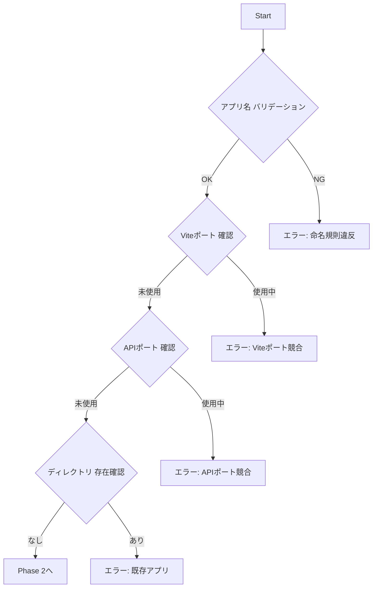

# Add New App to Workspace

pnpm workspaces + Turborepo モノレポへ **Hono SSR + Vite HMR 統合済み** の新規アプリを追加するコマンド

> 🤖 **Context Engineering**: このコマンドは段階的に情報を収集し、各ステップで検証を行いながら新規アプリをセットアップします。

---

## 🎯 Goal

`apps/` ディレクトリ配下に以下を含む新しいアプリケーションをセットアップ：

- **フロントエンド**: React 19 + Vite + Tailwind CSS v4 + **SSR**
- **バックエンド**: Hono + OpenAPI + Swagger UI
- **開発環境**: **SSR + HMR + Fast Refresh**
- **デプロイ**: Vercel Serverless Functions + Edge Middleware（**CSR**）
- **共有パッケージ**: `@myorg/ui`, `@myorg/shared`, `@myorg/ai`

---

## 📐 Architecture Overview

```mermaid
graph TB
    subgraph "Local Development (SSR + HMR)"
        B[Browser] --> |http://localhost:300x| SSR[Hono SSR Server<br/>server/dev.ts]
        SSR --> |vite.ssrLoadModule| RC[React Components]
        SSR --> |renderToString| HTML[SSR HTML]
        SSR --> |proxy| V[Vite Dev Server<br/>:517x]
        V --> |HMR WebSocket| B
    end
    
    subgraph "Vercel Production (CSR + Serverless)"
        EM[Edge Middleware<br/>middleware.ts] --> |認証後| EF[Serverless Functions<br/>api/route.ts]
        EM --> |静的ファイル| SF[Static Files<br/>dist/ (CSR)]
    end
    
    subgraph "Self-hosted Production (SSR)"
        HP[Hono Production<br/>server/production.ts] --> |SSR| D[dist/]
    end
```

### 環境別レンダリング方式

| 環境 | レンダリング | 使用ファイル |
|------|-------------|-------------|
| ローカル開発 | **SSR + HMR** | `server/dev.ts` |
| 本番（セルフホスト） | SSR | `server/production.ts` |
| Vercel | **CSR + Serverless** | `dist/` + `api/*.ts` |

---

## 📥 Required Inputs

以下の情報を収集してからセットアップを開始する：

| 入力項目 | 説明 | 例 | バリデーション |
|---------|------|-----|---------------|
| **appName** | アプリ名（kebab-case） | `dashboard`, `portal` | `^[a-z][a-z0-9-]*$` |
| **vitePort** | Vite開発サーバーのポート番号 | `5175` | 5173, 5174 以外の未使用ポート |
| **apiPort** | Hono APIサーバーのポート番号 | `3002` | 3000, 3001 以外の未使用ポート |
| **title** | HTMLのタイトル | `Dashboard App` | 任意の文字列 |
| **apiTitle** | OpenAPI ドキュメントのタイトル | `Dashboard API` | 任意の文字列 |
| **authScope** | 認証スコープ | `api-only` or `full-app` | 選択式 |
| **description** | アプリの説明（任意） | `社内ダッシュボード` | 任意 |

### 🔐 認証スコープの選択

| スコープ | 説明 | 用途 |
|---------|------|------|
| `api-only` | `/api/v1/*` のみ認証 | 公開フロントエンド + 保護されたAPI |
| `full-app` | 全画面認証（/health除く） | 管理画面・内部ツール |

### 🔍 Context Collection Prompt

```
新規アプリを追加するために、以下の情報を教えてください：

1. アプリ名は何にしますか？（例: dashboard, portal, analytics）
   - kebab-case（小文字とハイフン）で入力してください

2. ポート番号の設定
   - 既に使用中:
     - Vite: 5173 (@myorg/web), 5174 (@myorg/admin)
     - API: 3000 (@myorg/web), 3001 (@myorg/admin)
   - 推奨: Vite=5175〜, API=3002〜

3. ページタイトルは何にしますか？（例: Dashboard App）

4. API ドキュメントのタイトルは？（例: Dashboard API）

5. 認証スコープはどちらですか？
   - api-only: APIのみ認証（公開フロントエンド）
   - full-app: 全画面認証（管理画面向け）
```

---

## 🔄 Execution Steps

### Phase 1: Pre-flight Checks（事前確認）



#### Step 1.1: アプリ名のバリデーション

```bash
# kebab-case チェック（小文字とハイフンのみ）
if [[ ! "$APP_NAME" =~ ^[a-z][a-z0-9-]*$ ]]; then
  echo "❌ エラー: アプリ名は小文字のkebab-caseで指定してください"
  exit 1
fi
```

#### Step 1.2: ディレクトリ存在確認

```bash
if [ -d "apps/$APP_NAME" ]; then
  echo "❌ エラー: apps/$APP_NAME は既に存在します"
  exit 1
fi
```

#### Step 1.3: ポート番号の確認

```bash
# 既存アプリのViteポート番号を確認
grep -r "port:" apps/*/vite.config.ts | grep -v node_modules

# 既存アプリのAPIポート番号を確認
grep -r "port.*||" apps/*/server/dev.ts | grep -v node_modules
```

> ⚠️ 使用中ポート:
> - Vite: 5173（web）、5174（admin）
> - API: 3000（web）、3001（admin）

---

### Phase 2: ファイル生成

#### Step 2.1: ディレクトリ構造作成

```bash
mkdir -p apps/${APP_NAME}/{src,server/routes,api}
```

#### Step 2.2: package.json 生成

> 📝 **注意**: `@myorg/*` は実際のパッケージ名プレフィックスに置き換えること

```json
{
  "name": "@myorg/${APP_NAME}",
  "version": "0.0.0",
  "private": true,
  "type": "module",
  "scripts": {
    "dev": "vite",
    "dev:api": "tsx watch server/dev.ts",
    "build": "tsc -b && vite build && pnpm run build:ssr",
    "build:ssr": "vite build --ssr src/entry-server.tsx --outDir dist/server",
    "preview": "vite preview",
    "start": "tsx server/production.ts",
    "typecheck": "tsc --noEmit",
    "lint": "biome check --write .",
    "lint:check": "biome check ."
  },
  "dependencies": {
    "@ai-sdk/react": "beta",
    "@myorg/ai": "workspace:*",
    "@myorg/shared": "workspace:*",
    "@myorg/ui": "workspace:*",
    "@hono/node-server": "^1.19.7",
    "hono": "^4.11.1",
    "react": "^19.2.3",
    "react-dom": "^19.2.3",
    "zod": "^4.2.1"
  },
  "devDependencies": {
    "@hono/zod-openapi": "^1.1.5",
    "@scalar/hono-api-reference": "^0.9.28",
    "@vercel/edge": "^1.2.1",
    "@tailwindcss/vite": "^4.1.18",
    "@types/node": "^25.0.2",
    "@types/react": "^19.2.7",
    "@types/react-dom": "^19.2.3",
    "@vitejs/plugin-react": "^5.1.2",
    "tailwindcss": "^4.1.18",
    "tsx": "^4.21.0",
    "typescript": "~5.9.3",
    "vite": "^7.3.0"
  }
}
```

#### Step 2.3: tsconfig.json 生成（フロントエンド用）

```json
{
  "compilerOptions": {
    "target": "ES2022",
    "lib": ["ES2023", "DOM", "DOM.Iterable"],
    "module": "ESNext",
    "skipLibCheck": true,
    "moduleResolution": "bundler",
    "allowImportingTsExtensions": true,
    "verbatimModuleSyntax": true,
    "moduleDetection": "force",
    "noEmit": true,
    "jsx": "react-jsx",
    "strict": true,
    "noUnusedLocals": true,
    "noUnusedParameters": true,
    "noFallthroughCasesInSwitch": true,
    "paths": {
      "@/*": ["./src/*"]
    }
  },
  "include": ["src/**/*"]
}
```

#### Step 2.4: vite.config.ts 生成（SSR設定含む）

```typescript
import { resolve } from 'node:path';
import tailwindcss from '@tailwindcss/vite';
import react from '@vitejs/plugin-react';
import { defineConfig } from 'vite';

/**
 * ${APP_NAME} アプリケーションの Vite 設定
 * @description SSRビルド対応
 */
export default defineConfig({
  plugins: [
    react({
      // SSR環境でのFast Refresh preambleエラーを回避
      jsxRuntime: 'automatic',
      // モノレポ内の共有パッケージではpreambleチェックをスキップ
      include: /\.(tsx?|jsx?)$/,
      exclude: /node_modules/,
    }),
    tailwindcss(),
  ],
  resolve: {
    alias: {
      '@': resolve(import.meta.dirname, './src'),
    },
  },
  server: {
    port: ${VITE_PORT},
    proxy: {
      '/api': {
        target: 'http://localhost:${API_PORT}',
        changeOrigin: true,
      },
    },
  },
  // ⬇️ SSR設定（重要！）
  ssr: {
    noExternal: [],
    // react と react-dom はNode.jsネイティブで処理
    external: ['react', 'react-dom'],
  },
  build: {
    manifest: true, // マニフェストを生成（SSRでアセットパスを取得するため）
    ssrManifest: true, // SSR用マニフェストを生成
    outDir: 'dist',
    rollupOptions: {
      output: {
        manualChunks: undefined, // SSRではチャンク分割を無効化
      },
    },
  },
});
```

#### Step 2.5: index.html 生成（SSRプレースホルダー含む）

> 💡 **Single Source of Truth**: index.html を唯一のHTMLテンプレートとして使用し、SSRとCSRで2重管理を避ける

```html
<!doctype html>
<html lang="ja">
  <head>
    <meta charset="UTF-8" />
    <link rel="icon" type="image/svg+xml" href="/vite.svg" />
    <meta name="viewport" content="width=device-width, initial-scale=1.0" />
    <title><!--ssr-title-->${TITLE}<!--/ssr-title--></title>
    <meta name="description" content="<!--ssr-description-->${DESCRIPTION}<!--/ssr-description-->" />
    <!--ssr-head-->
  </head>
  <body>
    <div id="root"><!--ssr-outlet--></div>
    <script type="module" src="/src/main.tsx"></script>
  </body>
</html>
```

**SSRプレースホルダーの説明:**

| プレースホルダー | 用途 | CSR時 | SSR時 |
|-----------------|------|-------|-------|
| `<!--ssr-title-->...<!--/ssr-title-->` | ページタイトル | デフォルト値を表示 | 動的に置換 |
| `<!--ssr-description-->...<!--/ssr-description-->` | meta description | デフォルト値を表示 | 動的に置換 |
| `<!--ssr-head-->` | 追加のheadタグ | 何も出力しない | `__INITIAL_DATA__`等を注入 |
| `<!--ssr-outlet-->` | Reactアプリの出力先 | 空（CSRで描画） | SSR HTMLを注入 |

#### Step 2.6: src/index.css 生成（Tailwind CSS v4）

```css
@import 'tailwindcss';

@theme {
  --color-background: hsl(0 0% 100%);
  --color-foreground: hsl(222.2 84% 4.9%);
  --color-muted-foreground: hsl(215.4 16.3% 46.9%);
  --color-primary: hsl(222.2 47.4% 11.2%);
  --color-primary-foreground: hsl(210 40% 98%);
}

@media (prefers-color-scheme: dark) {
  @theme {
    --color-background: hsl(222.2 84% 4.9%);
    --color-foreground: hsl(210 40% 98%);
    --color-muted-foreground: hsl(215 20.2% 65.1%);
    --color-primary: hsl(210 40% 98%);
    --color-primary-foreground: hsl(222.2 47.4% 11.2%);
  }
}
```

#### Step 2.7: src/main.tsx 生成（ハイドレーション対応）

```typescript
import { StrictMode } from 'react';
import { createRoot, hydrateRoot } from 'react-dom/client';
import { App } from './App';
import './index.css';

/**
 * サーバーから注入された初期データの型定義
 */
interface InitialData {
  title: string;
  description: string;
  timestamp: string;
}

/**
 * グローバルな初期データを型安全に取得
 */
declare global {
  interface Window {
    __INITIAL_DATA__?: InitialData;
  }
}

/**
 * アプリケーションのエントリーポイント
 * @description SSRされたHTMLがある場合はハイドレーション、ない場合は通常のレンダリング
 */
const rootElement = document.getElementById('root');
if (!rootElement) {
  throw new Error('Root element not found');
}

// サーバーから注入された初期データを取得
const initialData = window.__INITIAL_DATA__ || {
  title: '${TITLE}',
  description: '${DESCRIPTION}',
  timestamp: new Date().toISOString(),
};

const appElement = (
  <StrictMode>
    <App initialData={initialData} />
  </StrictMode>
);

/**
 * SSRされたHTMLが実際に存在するか判定
 * @description hasChildNodes() は空白やコメントも含むため、
 * 実際のElement子要素の存在を確認する
 */
const hasSSRContent = (): boolean => {
  // Element要素（空白やコメントを除く）が存在するかチェック
  const hasElementChildren = rootElement.children.length > 0;
  // または、サーバーから初期データが注入されているか
  const hasInitialData = typeof window.__INITIAL_DATA__ !== 'undefined';
  return hasElementChildren || hasInitialData;
};

// SSRされたHTMLがある場合はハイドレーション
// そうでない場合は通常のレンダリング（CSR）
if (hasSSRContent()) {
  console.log('🔄 Hydrating React app...');
  hydrateRoot(rootElement, appElement, {
    onRecoverableError: (error) => {
      console.error('⚠️ Hydration recoverable error:', error);
    },
  });
} else {
  console.log('⚡ Rendering React app (CSR)...');
  createRoot(rootElement).render(appElement);
}
```

#### Step 2.8: src/entry-server.tsx 生成（本番SSR用エントリー）

```typescript
import { createElement, StrictMode } from 'react';
import { renderToString } from 'react-dom/server';
import { App } from './App';

/**
 * サーバーから注入される初期データの型定義
 */
interface InitialData {
  title: string;
  description: string;
  timestamp: string;
}

/**
 * 本番環境SSR用のレンダリング関数
 * @description Vite SSRビルドで使用されるエントリーポイント
 * @param url - リクエストURL
 * @param manifest - Vite SSRマニフェスト（アセット解決用）
 * @returns レンダリングされたHTML文字列と初期データ
 */
export const render = async (url: string, manifest: Record<string, string[]>) => {
  // URLに基づいて初期データを生成
  const initialData: InitialData = {
    title: '${TITLE}',
    description: '${DESCRIPTION}',
    timestamp: new Date().toISOString(),
  };

  // Reactコンポーネントを文字列としてレンダリング
  const appHtml = renderToString(
    createElement(StrictMode, {}, createElement(App, { initialData })),
  );

  // クライアント側でハイドレーションするために必要なアセットを解決
  // Vite SSRマニフェストから必要なスクリプトやCSSを抽出するロジックをここに追加可能
  // 現状はmain.tsxが直接読み込まれるため、ここでは特別な処理は不要

  return { html: appHtml, initialData };
};
```

> 💡 **エントリーポイントの役割**:
> - `src/main.tsx` → クライアント側（ブラウザ）でのエントリーポイント
> - `src/entry-server.tsx` → 本番環境のサーバー側でのSSRエントリーポイント
> - 開発時は `server/dev.ts` が直接 `App.tsx` を読み込んでレンダリング

#### Step 2.9: src/App.tsx 生成（initialData props 対応）

```typescript
import { Button, cn } from '@myorg/ui';
import type { FC } from 'react';

/**
 * 初期データの型定義
 */
interface InitialData {
  title: string;
  description: string;
  timestamp: string;
}

/**
 * Appコンポーネントのプロパティ
 */
interface AppProps {
  initialData?: InitialData;
}

/**
 * ${APP_NAME} アプリケーションのルートコンポーネント
 * @description SSRで初期データを受け取り、ハイドレーション後も状態を維持
 */
export const App: FC<AppProps> = ({ initialData }) => {
  return (
    <div className={cn('min-h-screen bg-background p-8')}>
      <h1 className="text-3xl font-bold mb-4">
        {initialData?.title || '${TITLE}'}
      </h1>
      <p className="text-muted-foreground mb-4">
        {initialData?.description || '${DESCRIPTION}'}
      </p>
      <p className="text-sm text-muted-foreground mb-4">
        Rendered at: {initialData?.timestamp}
      </p>
      <Button onClick={() => alert('Hello from ${APP_NAME}!')}>
        クリックしてね
      </Button>
    </div>
  );
};
```

---

### Phase 2.5: Hono サーバーファイル生成

#### Step 2.10: server/tsconfig.json 生成

```json
{
  "extends": "../../../tsconfig.json",
  "compilerOptions": {
    "target": "ES2022",
    "module": "NodeNext",
    "moduleResolution": "NodeNext",
    "outDir": "../dist-server",
    "rootDir": ".",
    "strict": true,
    "esModuleInterop": true,
    "skipLibCheck": true,
    "noEmit": false
  },
  "include": ["./**/*.ts"],
  "exclude": ["node_modules"]
}
```

#### Step 2.11: server/app.ts 生成

```typescript
import type { ApiError } from '@myorg/shared';
import { OpenAPIHono } from '@hono/zod-openapi';
import { Scalar } from '@scalar/hono-api-reference';
import type { Context, Next } from 'hono';
import { cors } from 'hono/cors';
import { HTTPException } from 'hono/http-exception';
import { prettyJSON } from 'hono/pretty-json';
import { requestId } from 'hono/request-id';
import { secureHeaders } from 'hono/secure-headers';
import { healthRoutes } from './routes/health.js';

/**
 * リクエストID付きHono Context型
 */
type Variables = {
  requestId: string;
};

/**
 * Honoアプリケーションインスタンス
 * @description 認証は各サーバー設定で適用
 */
const app = new OpenAPIHono<{ Variables: Variables }>();

// ============ ミドルウェア設定 ============

// リクエストID（トレーサビリティ向上）
app.use('*', requestId());

// セキュリティヘッダー
app.use('*', secureHeaders());

// ロギング（リクエストIDを含む）
app.use('*', async (c: Context<{ Variables: Variables }>, next: Next) => {
  const start = Date.now();
  await next();
  const ms = Date.now() - start;
  const reqId = c.get('requestId') ?? '-';
  console.log(
    `[${reqId}] ${c.req.method} ${c.req.path} - ${c.res.status} (${ms}ms)`,
  );
});

// CORS
app.use('*', cors());

// Pretty JSON（開発時の可読性向上）
app.use('*', prettyJSON());

// ============ ルート登録 ============

app.route('/', healthRoutes);

// ============ OpenAPI仕様 ============

app.doc('/api/doc', {
  openapi: '3.1.0',
  info: {
    title: '${API_TITLE}',
    version: '0.1.0',
    description: '${DESCRIPTION}',
  },
  servers: [
    {
      url: 'http://localhost:${API_PORT}',
      description: '開発環境',
    },
    {
      url: 'https://myorg-${APP_NAME}.vercel.app',
      description: 'Vercel本番環境',
    },
  ],
});

// Swagger UI (Scalar)
app.get(
  '/api/ui',
  Scalar({
    url: '/api/doc',
  }),
);

// ============ エラーハンドリング ============

/**
 * 404 Not Found ハンドラー
 */
app.notFound((c) => {
  const errorResponse: ApiError = {
    success: false,
    error: {
      code: 'NOT_FOUND',
      message: `Route ${c.req.method} ${c.req.path} not found`,
    },
    requestId: c.get('requestId'),
    timestamp: new Date().toISOString(),
  };
  return c.json(errorResponse, 404);
});

/**
 * グローバルエラーハンドラー
 * @description HTTPException, ZodError, 予期しないエラーを統一形式で返す
 */
app.onError((err, c) => {
  const reqId = c.get('requestId');
  const timestamp = new Date().toISOString();

  // HTTPExceptionの場合
  if (err instanceof HTTPException) {
    const errorResponse: ApiError = {
      success: false,
      error: {
        code: `HTTP_${err.status}`,
        message: err.message,
      },
      requestId: reqId,
      timestamp,
    };
    return c.json(errorResponse, err.status);
  }

  // Zodバリデーションエラーの場合（@hono/zod-openapiが投げる）
  if (err.name === 'ZodError' && 'issues' in err) {
    const zodError = err as {
      issues: Array<{ path: (string | number)[]; message: string }>;
    };
    const errorResponse: ApiError = {
      success: false,
      error: {
        code: 'VALIDATION_ERROR',
        message: 'リクエストのバリデーションに失敗しました',
        details: {
          issues: zodError.issues.map((issue) => ({
            path: issue.path.join('.'),
            message: issue.message,
          })),
        },
      },
      requestId: reqId,
      timestamp,
    };
    return c.json(errorResponse, 400);
  }

  // 予期しないエラー
  console.error(`[${reqId}] Unhandled error:`, err);
  const errorResponse: ApiError = {
    success: false,
    error: {
      code: 'INTERNAL_SERVER_ERROR',
      message:
        process.env.NODE_ENV === 'production'
          ? 'Internal server error'
          : err.message,
    },
    requestId: reqId,
    timestamp,
  };
  return c.json(errorResponse, 500);
});

export type AppType = typeof app;
export { app };
export default app;
```

#### Step 2.12: server/dev.ts 生成（SSR + HMR 統合）

> 💡 開発環境では Vite Dev Server と Hono SSR Server を統合して、SSR + HMR を実現

##### 認証スコープ: `api-only`（APIのみ認証）

```typescript
import { readFile } from 'node:fs/promises';
import { serve } from '@hono/node-server';
import { OpenAPIHono } from '@hono/zod-openapi';
import { basicAuth } from 'hono/basic-auth';
import { createElement, StrictMode } from 'react';
import { renderToString } from 'react-dom/server';
import { createServer as createViteServer, type ViteDevServer } from 'vite';
import { apiRoutes } from './app.js';

/**
 * 開発用SSRサーバー（Vite統合）
 * @description ViteのSSRモジュールローダーを使用してSSR + HMRを実現
 */

// グローバルなViteインスタンス
let vite: ViteDevServer;

/**
 * Viteインスタンスを作成
 */
const createVite = async () => {
  vite = await createViteServer({
    server: {
      middlewareMode: false, // Viteを独立したサーバーとして起動
      port: ${VITE_PORT},
      hmr: {
        port: ${VITE_PORT},
      },
    },
    appType: 'custom',
  });

  await vite.listen();
  return vite;
};

/**
 * 開発サーバーを起動
 */
const startDevServer = async () => {
  const port = Number(process.env.${APP_NAME_UPPER}_API_PORT) || ${API_PORT};

  // Vite dev serverを起動
  console.log('🔧 Starting Vite dev server...');
  await createVite();
  console.log('✅ Vite dev server ready at http://localhost:${VITE_PORT}');

  // Honoアプリを作成
  const app = new OpenAPIHono();

  // API部分にBasic認証を適用
  app.use(
    '/api/v1/*',
    basicAuth({
      username: process.env.BASIC_AUTH_USERNAME ?? 'admin',
      password: process.env.BASIC_AUTH_PASSWORD ?? 'admin',
    }),
  );

  // APIルートをマウント
  app.route('/api', apiRoutes);

  // Vite関連アセットをプロキシ
  const VITE_PROXY_PATHS = [
    '/src/*',
    '/@vite/*',
    '/@fs/*',
    '/@id/*',
    '/@react-refresh',
    '/node_modules/*',
    '/@vite-plugin-*',
  ];

  for (const path of VITE_PROXY_PATHS) {
    app.use(path, async (c) => {
      const url = new URL(c.req.url);
      const viteUrl = `http://localhost:${VITE_PORT}${url.pathname}${url.search}`;
      try {
        const res = await fetch(viteUrl);
        return new Response(res.body, {
          status: res.status,
          headers: res.headers,
        });
      } catch (error) {
        console.error(`Failed to proxy ${viteUrl}:`, error);
        return c.text('Proxy error', 500);
      }
    });
  }

  // React SSRエンドポイント（ViteのssrLoadModuleを使用）
  app.get('*', async (c) => {
    const url = c.req.url;

    try {
      // 初期データを取得
      const initialData = {
        title: '${TITLE}',
        description: '${DESCRIPTION}',
        timestamp: new Date().toISOString(),
      };

      // ViteでReactコンポーネントをSSRロード（Appコンポーネントのみ）
      const { App } = await vite.ssrLoadModule('/src/App.tsx');

      // ReactコンポーネントをSSR（StrictModeで囲む）
      const appHtml = renderToString(
        createElement(StrictMode, {}, createElement(App, { initialData })),
      );

      // index.html を読み込み（Single Source of Truth）
      const rawTemplate = await readFile('index.html', 'utf-8');

      // ViteのHTML変換を適用（HMRクライアント注入、モジュールパス解決）
      const template = await vite.transformIndexHtml(url, rawTemplate);

      // SSR用プレースホルダーを置換
      const html = template
        .replace(
          /<!--ssr-title-->.*?<!--\/ssr-title-->/,
          initialData.title,
        )
        .replace(
          /<!--ssr-description-->.*?<!--\/ssr-description-->/,
          initialData.description,
        )
        .replace(
          '<!--ssr-head-->',
          `<script>window.__INITIAL_DATA__ = ${JSON.stringify(initialData)};</script>`,
        )
        .replace('<!--ssr-outlet-->', appHtml);

      return c.html(html);
    } catch (error) {
      // SSRエラー処理
      if (error instanceof Error) {
        vite.ssrFixStacktrace(error);
        console.error('❌ SSR Error:', error.message);
        console.error(error.stack);
      }

      // エラー時はindex.htmlをそのまま返す（CSRフォールバック）
      try {
        const fallbackTemplate = await readFile('index.html', 'utf-8');
        const fallbackHtml = await vite.transformIndexHtml(url, fallbackTemplate);
        return c.html(fallbackHtml, 500);
      } catch {
        return c.html('<html><body><h1>Server Error</h1></body></html>', 500);
      }
    }
  });

  console.log('');
  console.log('🔧 ${APP_NAME} Development Server (Vite SSR Integration)');
  console.log(`🚀 SSR Server: http://localhost:${port}`);
  console.log(`⚡ Vite Dev Server: http://localhost:${VITE_PORT}`);
  console.log(`📖 Swagger UI: http://localhost:${port}/api/ui`);
  console.log(`📄 OpenAPI JSON: http://localhost:${port}/api/doc`);
  console.log('🔐 API認証: /api/v1/* のみ');
  console.log('💡 SSR + HMR + Fast Refresh enabled!');
  console.log('');

  serve(
    {
      fetch: app.fetch,
      port,
    },
    (info) => {
      console.log(`✅ SSR Server running at http://localhost:${info.port}`);
    },
  );
};

// サーバー起動
startDevServer().catch((err) => {
  console.error('❌ Failed to start dev server:', err);
  process.exit(1);
});

// プロセス終了時にViteをクリーンアップ
process.on('SIGTERM', () => {
  if (vite) {
    vite.close();
  }
  process.exit(0);
});
```

##### 認証スコープ: `full-app`（全画面認証）

> 📝 `full-app` の場合は、上記の `api-only` テンプレートを基に、Basic認証部分を以下に差し替え：

```typescript
// ヘルスチェック・OpenAPIドキュメント以外にBasic認証を適用
app.use('*', async (c, next) => {
  const publicPaths = ['/health', '/api/doc', '/api/ui'];
  if (publicPaths.some((path) => c.req.path.startsWith(path))) {
    return next();
  }
  const auth = basicAuth({
    username: process.env.BASIC_AUTH_USERNAME ?? 'admin',
    password: process.env.BASIC_AUTH_PASSWORD ?? 'admin',
  });
  return auth(c, next);
});
```

#### Step 2.13: server/production.ts 生成（セルフホスト用SSR）

> 📝 Vercelデプロイではこのファイルは使用されない（CSRビルドが配信される）

##### 認証スコープ: `api-only`

```typescript
import { readFile } from 'node:fs/promises';
import { join } from 'node:path';
import { serve } from '@hono/node-server';
import { serveStatic } from '@hono/node-server/serve-static';
import { OpenAPIHono } from '@hono/zod-openapi';
import { basicAuth } from 'hono/basic-auth';
import { apiRoutes } from './app.js';

/**
 * 本番用SSRサーバー（VPS/セルフホスト用）
 * @description React SSR + 静的ファイル配信 + API認証
 * @note Vercelデプロイでは使用しない（CSRが配信される）
 */

// SSRバンドルとマニフェストのパス
const CLIENT_DIST_PATH = join(process.cwd(), 'dist');
const SSR_DIST_PATH = join(process.cwd(), 'dist', 'server');
const SSR_MANIFEST_PATH = join(CLIENT_DIST_PATH, '.vite', 'ssr-manifest.json');

const prodApp = new OpenAPIHono();

// API部分にBasic認証を適用
prodApp.use(
  '/api/v1/*',
  basicAuth({
    username: process.env.BASIC_AUTH_USERNAME ?? 'admin',
    password: process.env.BASIC_AUTH_PASSWORD ?? 'admin',
  }),
);

// APIルートをマウント
prodApp.route('/api', apiRoutes);

// 静的ファイル配信（Viteビルド出力）
prodApp.use(
  '/*',
  serveStatic({
    root: './dist',
  }),
);

// SSRエンドポイント
prodApp.get('*', async (c) => {
  try {
    // SSRバンドルを動的にインポート
    const { render } = await import(join(SSR_DIST_PATH, 'entry-server.js'));
    // クライアントビルドのマニフェストを読み込み
    const manifest = JSON.parse(await readFile(SSR_MANIFEST_PATH, 'utf-8'));
    // index.html をテンプレートとして読み込み
    const template = await readFile(join(CLIENT_DIST_PATH, 'index.html'), 'utf-8');

    // SSRレンダリング
    const { html, initialData } = await render(c.req.url, manifest);

    // テンプレートのプレースホルダーを置換
    const finalHtml = template
      .replace(/<!--ssr-title-->.*?<!--\/ssr-title-->/, initialData.title)
      .replace(/<!--ssr-description-->.*?<!--\/ssr-description-->/, initialData.description)
      .replace('<!--ssr-head-->', `<script>window.__INITIAL_DATA__ = ${JSON.stringify(initialData)};</script>`)
      .replace('<!--ssr-outlet-->', html);

    return c.html(finalHtml);
  } catch (error) {
    console.error('❌ SSR Error:', error);
    // SSRエラー時はSPAフォールバック
    const indexPath = join(CLIENT_DIST_PATH, 'index.html');
    const html = await readFile(indexPath, 'utf-8');
    return c.html(html, 500);
  }
});

const port = Number(process.env.${APP_NAME_UPPER}_PORT) || ${API_PORT};

console.log('🚀 ${APP_NAME} Production Server (Self-hosted) with SSR');
console.log(`🌐 Application: http://localhost:${port}`);
console.log(`📖 Swagger UI: http://localhost:${port}/api/ui`);
console.log(`📄 OpenAPI JSON: http://localhost:${port}/api/doc`);
console.log('🔐 API認証: /api/v1/* のみ');
console.log('⚡ React SSR enabled');

serve({
  fetch: prodApp.fetch,
  port,
});
```

##### 認証スコープ: `full-app`

```typescript
import { readFile } from 'node:fs/promises';
import { join } from 'node:path';
import { serve } from '@hono/node-server';
import { serveStatic } from '@hono/node-server/serve-static';
import { OpenAPIHono } from '@hono/zod-openapi';
import { basicAuth } from 'hono/basic-auth';
import { apiRoutes } from './app.js';

/**
 * 本番用SSRサーバー（VPS/セルフホスト用）
 * @description React SSR + 静的ファイル配信 + Basic認証
 * @note Vercelデプロイでは使用しない（CSRが配信される）
 */

// SSRバンドルとマニフェストのパス
const CLIENT_DIST_PATH = join(process.cwd(), 'dist');
const SSR_DIST_PATH = join(process.cwd(), 'dist', 'server');
const SSR_MANIFEST_PATH = join(CLIENT_DIST_PATH, '.vite', 'ssr-manifest.json');

const prodApp = new OpenAPIHono();

// 全体にBasic認証を適用（ヘルスチェック以外）
prodApp.use('*', async (c, next) => {
  // ヘルスチェックは認証なし（監視ツール用）
  if (c.req.path === '/health') {
    return next();
  }
  const auth = basicAuth({
    username: process.env.BASIC_AUTH_USERNAME ?? 'admin',
    password: process.env.BASIC_AUTH_PASSWORD ?? 'admin',
  });
  return auth(c, next);
});

// APIルートをマウント
prodApp.route('/api', apiRoutes);

// 静的ファイル配信（Viteビルド出力）
prodApp.use(
  '/*',
  serveStatic({
    root: './dist',
  }),
);

// SSRエンドポイント
prodApp.get('*', async (c) => {
  try {
    // SSRバンドルを動的にインポート
    const { render } = await import(join(SSR_DIST_PATH, 'entry-server.js'));
    // クライアントビルドのマニフェストを読み込み
    const manifest = JSON.parse(await readFile(SSR_MANIFEST_PATH, 'utf-8'));
    // index.html をテンプレートとして読み込み
    const template = await readFile(join(CLIENT_DIST_PATH, 'index.html'), 'utf-8');

    // SSRレンダリング
    const { html, initialData } = await render(c.req.url, manifest);

    // テンプレートのプレースホルダーを置換
    const finalHtml = template
      .replace(/<!--ssr-title-->.*?<!--\/ssr-title-->/, initialData.title)
      .replace(/<!--ssr-description-->.*?<!--\/ssr-description-->/, initialData.description)
      .replace('<!--ssr-head-->', `<script>window.__INITIAL_DATA__ = ${JSON.stringify(initialData)};</script>`)
      .replace('<!--ssr-outlet-->', html);

    return c.html(finalHtml);
  } catch (error) {
    console.error('❌ SSR Error:', error);
    // SSRエラー時はSPAフォールバック
    const indexPath = join(CLIENT_DIST_PATH, 'index.html');
    const html = await readFile(indexPath, 'utf-8');
    return c.html(html, 500);
  }
});

const port = Number(process.env.${APP_NAME_UPPER}_PORT) || ${API_PORT};

console.log('🚀 ${APP_NAME} Production Server (Self-hosted) with SSR');
console.log(`🌐 Application: http://localhost:${port}`);
console.log(`📖 Swagger UI: http://localhost:${port}/api/ui`);
console.log(`📄 OpenAPI JSON: http://localhost:${port}/api/doc`);
console.log('🔐 認証: 全画面（/health 以外）');
console.log('⚡ React SSR enabled');

serve({
  fetch: prodApp.fetch,
  port,
});
```

#### Step 2.14: server/appVercel.ts 生成（Vercel Serverless用）

> 💡 Vercel Serverless Functions で使用する軽量版Honoアプリ。Edge Runtimeの制約により、`@hono/zod-openapi` などは使用しない。

```typescript
import { Hono } from 'hono';
import * as shared from '@myorg/shared';

/**
 * Vercel Functions向けのHonoアプリケーション（軽量版）
 * @description Edge Runtime の制約により、最小限の実装
 * @see https://hono.dev/docs/getting-started/vercel
 */
const createApp = () => {
  const app = new Hono();

  // ヘルスチェック
  app.get('/health', (c) => c.json({ status: 'ok' }));
  app.get('/api/health', (c) => c.json({ status: 'ok' }));

  // デバッグ用: 依存関係のimport確認
  app.get('/api/debug/import', async (c) => {
    const url = new URL(c.req.url);
    const target = url.searchParams.get('target');

    const allowedTargets = [
      '@myorg/shared',
      '@hono/zod-openapi',
      'hono/secure-headers',
      './routes/health.js',
    ] as const;

    const isAllowed = (value: string): value is (typeof allowedTargets)[number] =>
      (allowedTargets as readonly string[]).includes(value);

    if (!target || !isAllowed(target)) {
      return c.json(
        {
          ok: false,
          error: 'invalid_target',
          allowedTargets,
        },
        400,
      );
    }

    try {
      const imported = await import(target);
      const keys = Object.keys(imported as Record<string, unknown>);
      return c.json({ ok: true, target, keys });
    } catch (err) {
      const error = err instanceof Error ? err : new Error('Unknown error');
      return c.json(
        {
          ok: false,
          target,
          name: error.name,
          message: error.message,
          stack: error.stack,
        },
        500,
      );
    }
  });

  // デバッグ用: 静的インポート確認
  app.get('/api/debug/static', (c) => {
    const keys = Object.keys(shared as Record<string, unknown>);
    return c.json({ ok: true, keys });
  });

  return app;
};

export default createApp();
```

#### Step 2.15: server/routes/health.ts 生成

```typescript
import { HealthResponseSchema } from '@myorg/shared';
import { createRoute, OpenAPIHono } from '@hono/zod-openapi';

/**
 * ヘルスチェック用ルーター
 */
export const healthRoutes = new OpenAPIHono();

/**
 * アプリケーションバージョン（package.jsonから取得）
 */
const APP_VERSION = process.env.npm_package_version ?? '0.1.0';

/**
 * ヘルスチェックルート定義
 */
const healthRoute = createRoute({
  method: 'get',
  path: '/health',
  tags: ['System'],
  summary: 'ヘルスチェック',
  description: '${APP_NAME} APIサーバーの稼働状態を確認',
  responses: {
    200: {
      content: {
        'application/json': {
          schema: HealthResponseSchema,
        },
      },
      description: 'サーバー稼働中',
    },
  },
});

healthRoutes.openapi(healthRoute, async (c) => {
  return c.json(
    {
      status: 'ok' as const,
      timestamp: new Date().toISOString(),
      version: APP_VERSION,
    },
    200,
  );
});
```

> 📝 **apiRoutes のエクスポート**: `server/app.ts` で `healthRoutes` を `apiRoutes` としてエクスポートする必要があります。

```typescript
// server/app.ts に追加
export { healthRoutes as apiRoutes };
```

---

### Phase 2.6: Vercel デプロイファイル生成

#### Step 2.16: api/[[...route]].ts 生成

> 💡 Hono公式ドキュメント推奨のシンプルな形式。`server/appVercel.ts` をインポートしてエクスポートするだけ。

```typescript
/**
 * Vercel Functions エントリポイント
 * @description Hono公式推奨のゼロコンフィグデプロイ
 * @see https://hono.dev/docs/getting-started/vercel
 * @note 認証は middleware.ts（Edge Middleware）で適用
 */
import app from '../server/appVercel.js';

export default app;
```

> ⚠️ **重要**: Vercel Edge Runtime では `@myorg/shared` の一部や `@hono/zod-openapi`、`@scalar/hono-api-reference` がサポートされないため、`appVercel.ts` は最小限の実装になっています。

#### Step 2.17: middleware.ts 生成（Vercel Edge Middleware）

##### 認証スコープ: `api-only`

> ⚠️ **重要**: Vercel Edge Runtime では Hono モジュールがサポートされないため、純粋なJavaScriptで実装します。

```typescript
import { next } from '@vercel/edge';

/**
 * Vercel Edge Middleware - API認証のみ（純粋JS版）
 * @description /api/v1/* のみBasic認証を適用
 * @note Honoモジュールは Edge Runtime でサポートされないため純粋JSで実装
 */
export const config = {
  matcher: ['/api/v1/:path*'],
};

/**
 * Basic認証の検証
 */
const verifyCredentials = (authHeader: string | null): boolean => {
  if (!authHeader?.startsWith('Basic ')) {
    return false;
  }
  const base64Credentials = authHeader.slice(6);
  const credentials = atob(base64Credentials);
  const [username, password] = credentials.split(':');

  const validUsername = process.env.BASIC_AUTH_USERNAME ?? 'admin';
  const validPassword = process.env.BASIC_AUTH_PASSWORD ?? 'admin';

  return username === validUsername && password === validPassword;
};

/**
 * 401 Unauthorized レスポンス
 */
const unauthorizedResponse = (): Response => {
  return new Response('Unauthorized', {
    status: 401,
    headers: {
      'WWW-Authenticate': 'Basic realm="Secure Area"',
    },
  });
};

/**
 * Vercel Edge Middleware エントリーポイント
 */
export default async function middleware(request: Request) {
  // Basic認証チェック
  const authHeader = request.headers.get('Authorization');
  if (!verifyCredentials(authHeader)) {
    return unauthorizedResponse();
  }

  // 認証成功なら元のリクエストを続行
  return next();
}
```

##### 認証スコープ: `full-app`

> ⚠️ **重要**: Vercel Edge Runtime では Hono モジュールがサポートされないため、純粋なJavaScriptで実装します。

```typescript
import { next } from '@vercel/edge';

/**
 * Vercel Edge Middleware - Basic認証（純粋JS版）
 * @description 全画面にBasic認証を適用（静的ファイル含む）
 * @note Honoモジュールは Edge Runtime でサポートされないため純粋JSで実装
 */
export const config = {
  matcher: ['/((?!_next/static|_next/image|favicon.ico).*)'],
};

/**
 * Basic認証の検証
 */
const verifyCredentials = (authHeader: string | null): boolean => {
  if (!authHeader?.startsWith('Basic ')) {
    return false;
  }
  const base64Credentials = authHeader.slice(6);
  const credentials = atob(base64Credentials);
  const [username, password] = credentials.split(':');

  const validUsername = process.env.BASIC_AUTH_USERNAME ?? 'admin';
  const validPassword = process.env.BASIC_AUTH_PASSWORD ?? 'admin';

  return username === validUsername && password === validPassword;
};

/**
 * 401 Unauthorized レスポンス
 */
const unauthorizedResponse = (): Response => {
  return new Response('Unauthorized', {
    status: 401,
    headers: {
      'WWW-Authenticate': 'Basic realm="Secure Area"',
    },
  });
};

/**
 * Vercel Edge Middleware エントリーポイント
 */
export default async function middleware(request: Request) {
  const url = new URL(request.url);

  // ヘルスチェックは認証スキップ (for web/admin)
  if (url.pathname === '/health') {
    return next();
  }

  // Basic認証チェック
  const authHeader = request.headers.get('Authorization');
  if (!verifyCredentials(authHeader)) {
    return unauthorizedResponse();
  }

  // 認証成功なら元のリクエストを続行
  return next();
}
```

#### Step 2.18: vercel.json 生成

```json
{
  "$schema": "https://openapi.vercel.sh/vercel.json",
  "ignoreCommand": "git diff --quiet HEAD^ HEAD -- .",
  "buildCommand": "cd ../.. && pnpm turbo build --filter=@myorg/${APP_NAME}",
  "installCommand": "cd ../.. && pnpm install",
  "outputDirectory": "dist",
  "framework": "vite",
  "regions": ["hnd1"],
  "rewrites": [
    {
      "source": "/health",
      "destination": "/api/[[...route]]"
    },
    {
      "source": "/api/:path*",
      "destination": "/api/[[...route]]"
    },
    {
      "source": "/((?!assets/).*)",
      "destination": "/index.html"
    }
  ]
}
```

---

### Phase 3: 依存関係インストール & 検証

#### Step 3.1: pnpm install 実行

```bash
pnpm install
```

#### Step 3.2: 型チェック

```bash
pnpm --filter @myorg/${APP_NAME} typecheck
```

#### Step 3.3: Lint チェック

```bash
pnpm --filter @myorg/${APP_NAME} lint:check
```

#### Step 3.4: SSR開発サーバー起動確認

> 💡 `dev:api` でSSRサーバーを起動。内部でVite Dev Serverも起動されるため、`dev` は不要。

```bash
pnpm --filter @myorg/${APP_NAME} dev:api
```

ブラウザで `http://localhost:${API_PORT}` にアクセスし、以下を確認：
- ページが表示される
- コンソールに「🔄 Hydrating React app...」と表示される（SSR確認）
- ソース変更時にHMRが動作する

---

## ✅ Validation Checklist

セットアップ完了後、以下を確認する：

### SSR + HMR（開発環境）

```markdown
- [ ] `http://localhost:${API_PORT}` でアプリが表示される（SSRサーバー）
- [ ] ページソースを表示して、HTMLにReactコンポーネントが含まれている（SSR確認）
- [ ] コンソールに「🔄 Hydrating React app...」と表示される（ハイドレーション確認）
- [ ] ソース変更時にHMRが動作する（ページリロードなしで反映）
- [ ] @myorg/ui の Button コンポーネントが動作する
- [ ] ダークモード切り替え（OS設定）でテーマが変わる
```

### バックエンド（API）

```markdown
- [ ] `http://localhost:${API_PORT}/health` が 200 OK を返す
- [ ] `http://localhost:${API_PORT}/api/ui` で Swagger UI が表示される
- [ ] `http://localhost:${API_PORT}/api/doc` で OpenAPI JSON が取得できる
```

### ビルド・品質

```markdown
- [ ] `pnpm typecheck` が通る
- [ ] `pnpm lint` が通る
- [ ] `pnpm build --filter=@myorg/${APP_NAME}` が成功する（CSRビルド）
```

---

## 🚨 Troubleshooting

### エラー: Module not found '@myorg/ui'

```bash
# 原因: pnpm install が未実行または失敗
pnpm install

# それでも解決しない場合
rm -rf node_modules apps/${APP_NAME}/node_modules
pnpm install
```

### エラー: Port already in use

```bash
# 使用中のポートを確認
lsof -i :${VITE_PORT}
lsof -i :${API_PORT}

# vite.config.ts / server/dev.ts のポート番号を変更
```

### エラー: TypeScript path alias が解決できない

```bash
# tsconfig.json の paths 設定を確認
# vite.config.ts の alias 設定を確認
```

### エラー: API サーバーに接続できない

```bash
# 1. API サーバーが起動しているか確認
pnpm --filter @myorg/${APP_NAME} dev:api

# 2. Vite の proxy 設定を確認
# vite.config.ts の server.proxy.'/api'.target が正しいポートを指しているか
```

---

## 📂 Generated File Structure

```
apps/${APP_NAME}/
├── api/
│   └── [[...route]].ts      # Vercel Serverless Functions エントリー
├── server/
│   ├── app.ts               # APIルート定義（OpenAPI/Swagger）
│   ├── appVercel.ts         # Vercel用Honoアプリ（軽量版）
│   ├── dev.ts               # SSR + HMR 開発サーバー
│   ├── production.ts        # 本番用サーバー（セルフホスト）
│   ├── routes/
│   │   └── health.ts        # ヘルスチェックルート
│   └── tsconfig.json        # サーバー用TypeScript設定
├── src/
│   ├── index.css            # Tailwind CSS v4 設定
│   ├── main.tsx             # Reactエントリーポイント（ハイドレーション対応）
│   ├── entry-server.tsx     # 本番SSR用エントリー
│   └── App.tsx              # ルートコンポーネント（initialData props）
├── index.html               # HTMLテンプレート（SSRプレースホルダー含む）
├── middleware.ts            # Vercel Edge Middleware（認証）
├── package.json             # パッケージ定義
├── tsconfig.json            # フロントエンドTypeScript設定
├── vercel.json              # Vercelデプロイ設定
└── vite.config.ts           # Viteビルド設定（SSR設定含む）
```

---

## 🔗 Next Steps（オプション）

### テスト環境追加

```bash
# vitest.config.ts を追加
# testing/ ディレクトリを追加
```

### 追加ルートの実装

```bash
# server/routes/ に新しいルートファイルを追加
# 例: server/routes/users/index.ts
```

### AI 機能の追加

```typescript
// @myorg/ai パッケージを使用
import { chatAgent } from '@myorg/ai';
import { useChat } from '@ai-sdk/react';
```

---

## 📝 Summary Template

セットアップ完了時のサマリー出力テンプレート：

```markdown
## ✅ 新規アプリ「${APP_NAME}」のセットアップ完了！

| 項目 | 値 |
|------|-----|
| **パッケージ名** | @myorg/${APP_NAME} |
| **パス** | apps/${APP_NAME} |
| **SSRサーバー** | http://localhost:${API_PORT} ← メインアクセスURL |
| **Vite Dev** | http://localhost:${VITE_PORT}（HMR用） |
| **Swagger UI** | http://localhost:${API_PORT}/api/ui |
| **認証スコープ** | ${AUTH_SCOPE} |

### 🚀 起動方法

\`\`\`bash
# SSR + HMR 開発サーバーを起動（Vite Dev Serverも内部で起動）
pnpm --filter @myorg/${APP_NAME} dev:api
\`\`\`

### 📋 確認済み項目

- [x] ディレクトリ構造作成
- [x] SSR + HMR サーバー設定
- [x] Vercelデプロイ設定（CSR）
- [x] 依存関係インストール
- [x] 型チェック通過
- [x] Lintチェック通過
- [x] SSR起動確認（ハイドレーション動作）
- [x] HMR動作確認
```

---

## 🔧 Port Allocation Reference

| アプリ | SSRサーバー | Vite Dev | 環境変数 |
|--------|------------|----------|----------|
| @myorg/web | 3000 | 5173 | `API_PORT` |
| @myorg/admin | 3001 | 5174 | `ADMIN_API_PORT` |
| @myorg/playground | 3002 | 5175 | `PLAYGROUND_API_PORT` |
| 新アプリ | 3003〜 | 5176〜 | `${APP_NAME_UPPER}_API_PORT` |

> 💡 開発時は **SSRサーバー（300x）** にアクセスする。Vite Dev（517x）はHMR用で内部的に使用される。
