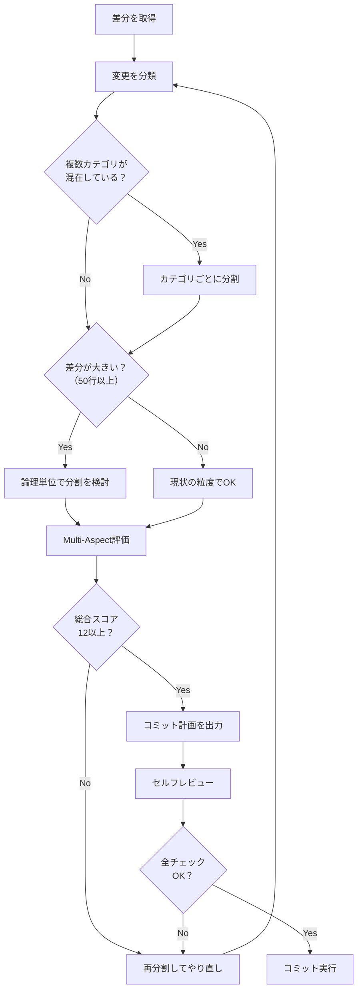

# commit-diffs

> **目的**: 現在の差分を分析し、最適な粒度でコミットを分割・実行する

---

## ゴール

このコマンドを実行すると、以下を達成する：

1. 現在の差分を**論理的な単位**に分類する
2. 各単位を**3つの評価軸**でスコアリングし、分割の妥当性を検証する
3. 最適なコミット順序と内容を決定し、実行する

---

## PHASE 1: 差分の分析と分類

### STEP 1-1: 差分の取得

```bash
git diff --stat
git diff
```

### STEP 1-2: 変更の分類

各変更を以下のカテゴリに分類する：

| カテゴリ | 説明 | 例 |
|---------|------|-----|
| **feat** | 新機能の追加 | 新しいAPI、UI機能 |
| **fix** | バグ修正 | 既存の動作の修正 |
| **refactor** | 振る舞いを変えないコード改善 | 関数の分割、命名変更 |
| **style** | フォーマット変更のみ | Prettier適用、空白調整 |
| **deps** | 依存関係の更新 | package.json変更 |
| **docs** | ドキュメント変更 | README、コメント |
| **test** | テストコードの変更 | テスト追加・修正 |
| **chore** | その他の雑務 | 設定ファイル、CI |

### STEP 1-3: 依存関係の特定

変更間の依存関係を分析し、以下を特定する：

- **独立した変更**: 他の変更なしで単独でコミット可能
- **依存する変更**: 他の変更が先にコミットされている必要がある
- **関連する変更**: 同じ論理単位として一緒にコミットすべき

---

## PHASE 2: コミット分割の評価（Multi-Aspect Scoring）

各コミット候補を**3つの観点**から評価する（各1-5点）：

### 評価軸

| 観点 | 評価基準 | 高スコア（5点） | 低スコア（1点） |
|------|----------|----------------|----------------|
| **原子性** | 1コミット＝1つの論理的変更か | 単一の目的、巻き戻し容易 | 複数の無関係な変更が混在 |
| **レビュー容易性** | レビュアーが理解しやすいか | 差分が小さく、意図が明確 | 差分が大きく、意図が不明瞭 |
| **履歴可読性** | 将来の履歴確認で有用か | 何をなぜ変えたか明確 | 曖昧なメッセージ、追跡困難 |

### 評価の実行

```
コミット候補ごとに：
├─ 原子性: [1-5] 理由: ...
├─ レビュー容易性: [1-5] 理由: ...
├─ 履歴可読性: [1-5] 理由: ...
└─ 総合: [3-15] → 12以上で合格、11以下は再分割を検討
```

---

## PHASE 3: Self-Refine（自己改善ループ）

### STEP 3-1: 初期分割案の作成

差分を分析し、最初のコミット分割案を作成する。

### STEP 3-2: セルフレビュー

作成した分割案を以下の観点でレビューする：

```
□ 各コミットは単独でビルド可能か？
□ 各コミットは単独でテストが通るか？
□ 無関係な変更が同じコミットに混在していないか？
□ 依存関係の順序は正しいか？
□ コミットメッセージは「何を／なぜ」を説明しているか？
```

### STEP 3-3: 修正と再評価

問題があれば修正し、PHASE 2の評価を再実行する。

```
IF 総合スコア < 12 OR セルフレビューでNG項目あり:
    分割を見直す
    再評価する
ELSE:
    PHASE 4へ進む
```

---

## PHASE 4: コミット計画の確定と実行

### 出力フォーマット

コミット計画を以下の形式で出力する：

```markdown
## コミット計画

### コミット 1/N: [カテゴリ] 概要
- **対象ファイル**: file1.ts, file2.ts
- **変更内容**: 〜を〜に変更
- **評価**:
  - 原子性: 5/5 - 単一の目的（〜）
  - レビュー容易性: 4/5 - 差分10行、意図明確
  - 履歴可読性: 5/5 - 変更理由が明確
  - 総合: 14/15 ✅
- **コミットメッセージ**:
  ```
  [カテゴリ]: 〜を〜する

  [本文：何を／なぜ変えたか]
  ```

### コミット 2/N: ...
```

### 実行

計画を確認後、順番にコミットを実行する。

---

## 📚 リファレンス

### コミットメッセージのルール

| 要素 | ルール |
|------|--------|
| **件名** | 日本語、命令形、〜50文字、末尾ピリオドなし |
| **本文** | 「何を」「なぜ」を説明 |
| **カテゴリ** | feat/fix/refactor/style/deps/docs/test/chore |

### Good / Bad Examples

#### ✅ Good: 適切な分割

**Before（1つの大きな差分）**:
- ユーザー一覧画面にページネーション追加
- 同時にリファクタ（関数分割）
- ついでにフォーマット修正

**After（3つのコミット）**:
```
1. style: ユーザー一覧画面のコードフォーマットを統一する
2. refactor: ユーザー一覧画面のデータ取得ロジックを分離する
3. feat: ユーザー一覧画面にページネーションを追加する
```

#### ❌ Bad: 不適切な分割

```
# NG: 複数の目的が混在
変更

# NG: 意図が不明
修正

# NG: 粒度が大きすぎ
機能追加とバグ修正とリファクタ
```

### 分割パターン

| シナリオ | 推奨分割 |
|----------|----------|
| フォーマット＋実装 | style → feat/fix |
| リファクタ＋機能追加 | refactor → feat |
| 依存更新＋コード変更 | deps → feat/fix |
| スキーマ変更＋コード | migration（段階的に） |
| テスト追加＋実装 | 同時OK（TDD的に1コミット可） |

---

## 判断フロー



---

## 実行開始

上記のフローに従い、現在の差分を分析してコミットを実行せよ。
